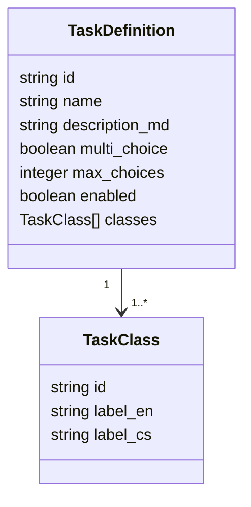

# API Reference

All application endpoints are served by the FastAPI backend. Authenticated annotator endpoints use JWT bearer authentication. Admin endpoints additionally require `is_superuser = true`.

## Public annotator API

| Method | Path | Purpose |
|---|---|---|
| `GET` | `/api/tasks` | List enabled task definitions. |
| `GET` | `/api/tasks/{task_id}` | Fetch one enabled task. |
| `POST` | `/api/texts/next` | Get the next text for selected task IDs. |
| `POST` | `/api/annotations` | Submit task annotations for one text. |
| `GET` | `/api/stats/me` | Return the current user's annotation totals. |
| `GET` | `/api/stats/leaderboard/{task_id}` | Return top annotators for one task. |

## Admin API

| Method | Path | Purpose |
|---|---|---|
| `GET` | `/api/admin/tasks` | List all tasks, including disabled tasks. |
| `POST` | `/api/admin/tasks` | Create or replace a task definition. |
| `PUT` | `/api/admin/tasks/{task_id}` | Update a task definition by ID. |
| `PATCH` | `/api/admin/tasks/{task_id}` | Enable, disable, or delete a task. |
| `POST` | `/api/admin/tasks/import-prompts` | Parse and upsert tasks from `prompts/*.md`. |
| `POST` | `/api/admin/texts` | Upload newline-delimited JSON text records. |

## Task definition schema



## Annotation payload

```json
{
  "text_id": "text-001",
  "annotations": [
    {
      "task_id": "communicative_mode",
      "selected_classes": ["record", "description"],
      "start_time": "2026-05-30T12:00:00Z",
      "end_time": "2026-05-30T12:00:10Z"
    }
  ]
}
```

The backend validates the selected class IDs against the current enabled task definition before inserting annotations.
