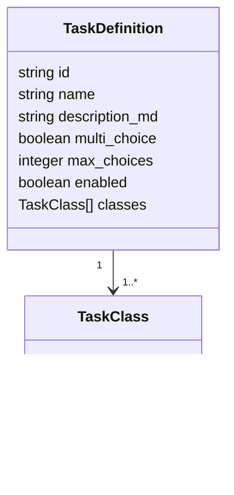

# API Reference

All application endpoints are served by the FastAPI backend. Authenticated annotator endpoints use JWT bearer authentication. Admin endpoints additionally require `is_superuser = true`.

## Public annotator API

| Method | Path | Purpose |
|---|---|---|
| `GET` | `/api/tasks` | List enabled task definitions (includes `current_multiplier`). |
| `GET` | `/api/tasks/{task_id}` | Fetch one enabled task. |
| `POST` | `/api/texts/next` | Get the next text for annotation. Response includes `calibration_task_ids`. |
| `POST` | `/api/annotations` | Submit task annotations. Returns `{"points": {task_id: float}}`. |
| `GET` | `/api/texts/{text_id}/ground-truth?task_ids=…` | Return GT labels for calibration feedback. |
| `GET` | `/api/stats/me` | Current user's annotation totals and score per task. |
| `GET` | `/api/stats/global` | Total annotation count and per-task breakdown. |
| `GET` | `/api/stats/leaderboard` | Top annotators across all tasks (count + score). Optional `?since_days=N`. |
| `GET` | `/api/stats/leaderboard/{task_id}` | Top annotators for one task. Optional `?since_days=N`. |

## Admin API

| Method | Path | Purpose |
|---|---|---|
| `GET` | `/api/admin/tasks` | List all tasks, including disabled tasks. |
| `POST` | `/api/admin/tasks` | Create or replace a task definition. Returns `{"imported": N}`. |
| `PUT` | `/api/admin/tasks/{task_id}` | Update a task definition by ID. |
| `PATCH` | `/api/admin/tasks/{task_id}` | Enable, disable, or delete a task. |
| `POST` | `/api/admin/tasks/import-prompts` | Parse and upsert tasks from `prompts/*.md`. Returns `{"imported": N}`. |
| `POST` | `/api/admin/texts` | Upload newline-delimited JSON text records. Returns `{"imported": N}`. |
| `GET` | `/api/admin/texts` | List text records with pagination and search. Query: `?page=0&q=&page_size=50`. |
| `PATCH` | `/api/admin/texts/{text_id}` | Suspend or unsuspend a text record. |
| `POST` | `/api/admin/ground-truth` | Upload ground-truth annotations as JSONL. Returns `{"imported": N}`. |
| `POST` | `/api/admin/llm-annotations` | Upload LLM-generated annotations as JSONL. Returns `{"imported": N}`. |
| `PATCH` | `/api/admin/annotations/{annotation_id}` | Change annotation type (`ground_truth` or `llm`). |
| `GET` | `/api/admin/irr` | Get all inter-rater reliability records. |
| `POST` | `/api/admin/irr/recompute` | Trigger on-demand IRR recomputation. |

## Task definition schema



`TaskClass.description` is optional. When present it is shown as a tooltip next to the class label during annotation.

## Annotation payload

```json
{
  "text_id": "text-001",
  "annotations": [
    {
      "task_id": "communicative_mode",
      "selected_classes": ["record", "description"],
      "start_time": "2026-05-30T12:00:00Z",
      "end_time": "2026-05-30T12:00:10Z"
    }
  ]
}
```

The backend validates selected class IDs. On success, returns `{"points": {"communicative_mode": 1.5}}` where the float is the Elo-style score awarded for that annotation.

## Next-text response

`POST /api/texts/next` returns:
```json
{
  "id": "text-001",
  "text": "…",
  "language": "ces",
  "calibration_task_ids": ["communicative_mode"]
}
```
`calibration_task_ids` is non-empty when the returned text has ground-truth labels for those tasks. The frontend should fetch `/api/texts/{text_id}/ground-truth?task_ids=…` after submission to display calibration feedback.

## Bulk annotation JSONL format (GT / LLM upload)

Each line:
```json
{"text_id": "text-001", "task_id": "style", "selected_classes": ["formal"]}
```

## TaskDefinition schema additions (sampling config)

| Field | Type | Default | Description |
|---|---|---|---|
| `calib_ratio_initial` | float [0,1] | 0.30 | Calibration sampling probability during initial phase |
| `calib_initial_count` | int | 20 | Annotations before switching to ongoing calibration ratio |
| `calib_ratio_ongoing` | float [0,1] | 0.10 | Calibration probability after initial phase |
| `repeat_probability` | float [0,1] | 0.20 | Probability of serving a text already annotated by others |
| `target_coverage` | int | 3 | Target number of annotations per text (affects scarcity multiplier) |
| `current_multiplier` | float? | — | Computed scarcity multiplier (read-only, not stored) |

## My stats response (`GET /api/stats/me`)

```json
{
  "total": 42,
  "per_task": {"style": 18, "complexity": 24},
  "score": 87.5,
  "per_task_score": {"style": 34.2, "complexity": 53.3}
}
```

## Leaderboard entry

```json
{
  "user_id": "…",
  "display_name": "Alice",
  "count": 42,
  "score": 87.5,
  "reliability": 0.83
}
```
`reliability` is null until the background IRR job has run.

## UserReliabilityResponse (`GET /api/admin/irr`)

```json
[
  {
    "user_id": "…",
    "display_name": "Alice",
    "task_id": "style",
    "annotation_count": 25,
    "pairwise_agreement": 0.76,
    "cohens_kappa": 0.62,
    "krippendorffs_alpha": 0.58,
    "ds_sensitivity": null,
    "computed_at": "2026-05-31T10:00:00Z"
  }
]
```
