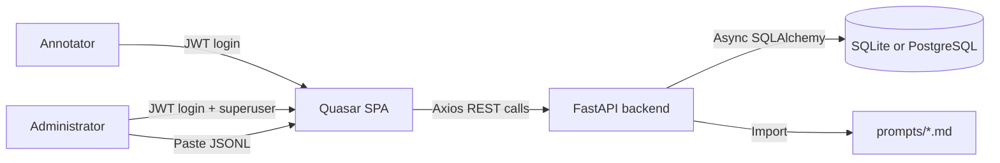
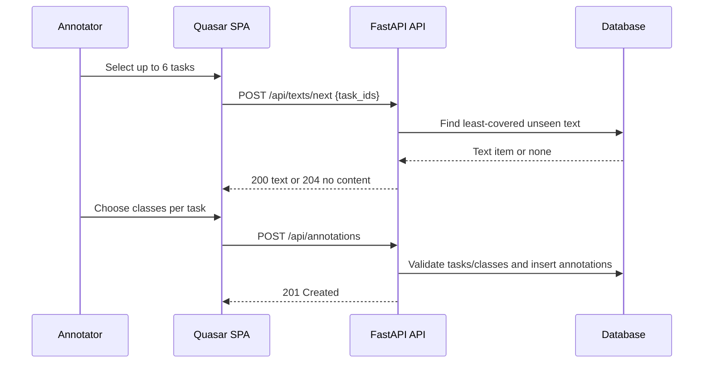
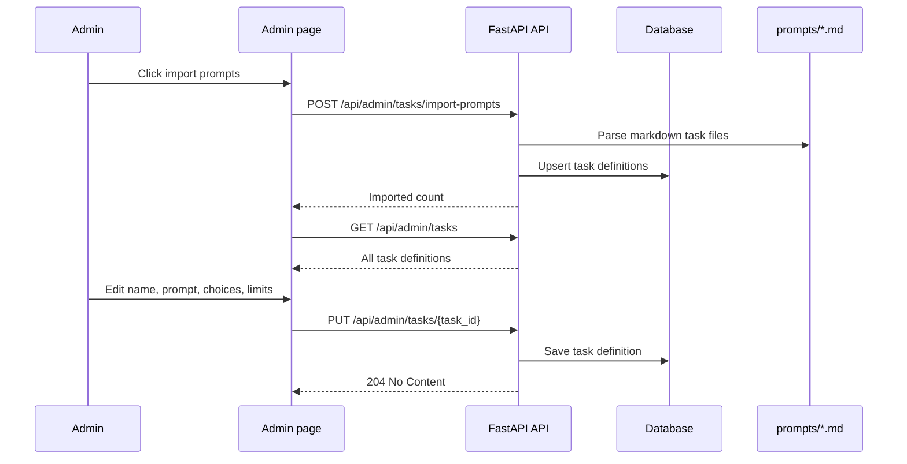

# semant_text_cl_app Architecture

This application collects human text-classification annotations for benchmarking AI classifiers. Annotators choose up to six enabled tasks, receive one text at a time, and submit class selections for each selected task. Administrators import markdown prompts as editable task definitions and upload JSONL text records.

## System context

## Backend responsibilities

- Authentication and user management use `fastapi-users` with JWT bearer tokens.
- Task definitions are stored in the database and include markdown instructions, class choices, enabled state, and single-choice or multi-choice limits.
- The prompt importer parses `prompts/*.md` into task definitions by reading the `# Classes` or `# Possible classes` section.
- Annotation validation checks that submitted class IDs are valid for the task and respect task choice limits.
- Text upload accepts JSONL rows with `id`, `text`, and `language`; all extra fields are preserved as raw JSON.

## Frontend responsibilities

- The task selection page loads enabled tasks and stores the selected task IDs locally.
- The classification page renders radio buttons for single-choice tasks and checkboxes for multi-choice tasks.
- The admin page imports markdown prompts, edits task names/prompts/choices, toggles enabled status, and uploads text JSONL.

## Annotation flow

## Admin task-editing flow

